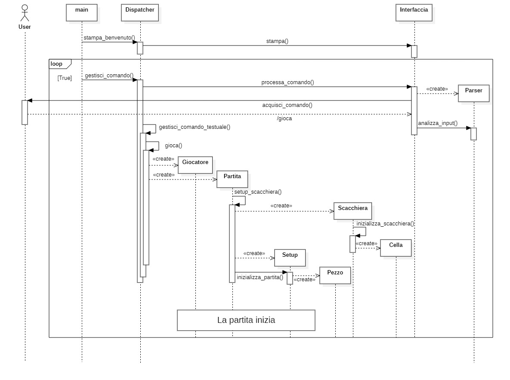
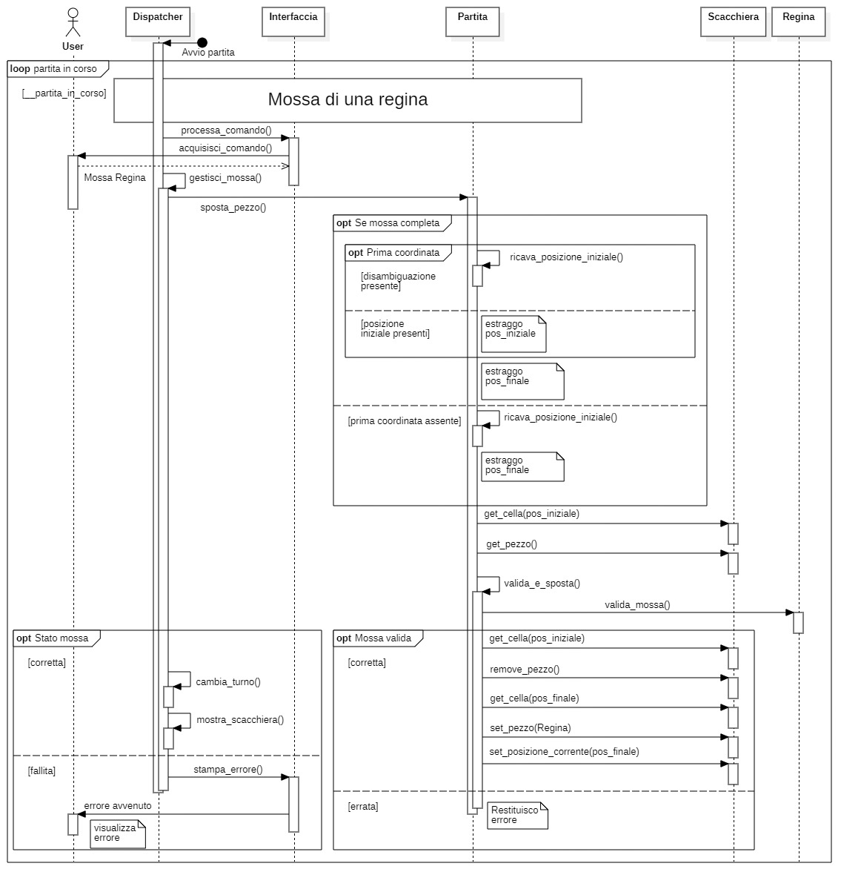
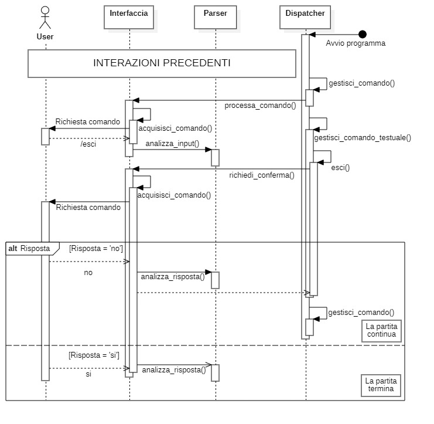

# 📘 Relazione Tecnica - Gioco degli scacchi ♟️

### 📌 Indice

1. [📖 Introduzione](#-1-introduzione)  
2. [🧠 Modello di Dominio](#-2-modello-di-dominio)  
3. [✅ Requisiti Specifici](#-3-requisiti-specifici)  
   - [3.1 Requisiti Funzionali](#31-requisiti-funzionali)    
   - [3.2 Requisiti Non Funzionali](#32-requisiti-non-funzionali)   
4. [📦 System Design](#-4-system-design)
      - [4.1 Principi ECB](#41-Applicazione-dellECB-e-Principi-di-Progettazione)
      - [4.2 Esempio di Flusso](#42-Esempio-di-Flusso)
      - [4.3 Diagramma dei package](#43-Diagramma-dei-packages)
      - [4.4 Albero della directory del progetto](#44-Albero-della-directory-del-progetto)
5. [🔵 OO Design](#-5-oo-design)
6. [👨🏻‍💻 Riepilogo del test](#-6-riepilogo-del-test)
      - [6.1 Criteri di Testing](#61-Strategia-e-Criteri-di-Testing)
      - [6.2. Copertura dei Moduli](#62-Copertura-dei-Moduli)
      - [6.3 Tipologie di Test Eseguiti](#63-Tipologie-di-Test-Eseguiti)
      - [6.4. Riepilogo casi di Test](#64-Riepilogo-casi-di-Test)
7. [🗃️ Processo di sviluppo e organizzazione del lavoro](#processo_sviluppo_e_organizzazione)
8. [🔍 Analisi retrospettiva](#-8-analisi-retrospettiva)  
   - [8.1 Sprint 0](#81-sprint-0)  
   - [8.2 Sprint 1](#82-sprint-1)  

---

## 📖 1. Introduzione

Il presente documento descrive l'architettura e l'implementazione di un **Gioco degli scacchi** completo sviluppato in _Python 3_, progettato secondo il pattern *ECB (Entity-Control-Boundary)*. L'applicazione offre:

- Un'interfaccia a riga di comando (_CLI_) interattiva;
- Le regole standard degli scacchi per spostare i pedoni;
- Gestione dello stato di gioco.

## 🧠 2. Modello di Dominio


## ✅ 3. Requisiti Specifici

### 3.1 Requisiti Funzionali

> <i>Clicca su ogni voce per saperne di più</i>

<details>
<summary> <b>🆘 US1 – Visualizzazione dell’help </b></summary>
<br>

| 🏷️ **Elemento**        | 📋 **Contenuto** |
|------------------------|------------------|
| **Descrizione**     | Il sistema deve fornire un elenco dei comandi disponibili. |
| **Attori**          | Giocatore |
| **Comando**         | `/help` |
| **Parametri**  | `--help`, `-h`  |
| **Comportamento atteso** | Mostrare una descrizione concisa dell'app con l'elenco dei comandi uno per riga.  |

> **Esempio di output:**  
> ```
> /gioca       Inizia una nuova partita di scacchi
> /esci        Chiude il gioco e termina il programma
> /patta       Propone un pareggio all'avversario
> /abbandona   Abbandona la partita in corso, concedendo la vittoria all'avversario
> /scacchiera  Visualizza la scacchiera con la posizione attuale dei pezzi
> /mosse       Mostra la cronologia delle mosse giocate finora nella partita
> ```

</details>

<details>
<summary> <b>🎮 US2 – Avvio nuova partita </b></summary>
<br>

| 🏷️ **Elemento**    | 📋 **Contenuto** |
|--------------------|------------------|
| **Descrizione** | Il giocatore può iniziare una nuova partita. |
| **Attori**      | Giocatore |
| **Comando**     | `/gioca` |
| **Comportamento atteso** | Visualizzare la scacchiera iniziale; il sistema attende la mossa del Bianco. |

</details>

<details>
<summary> <b>♟️ US3 – Visualizzazione scacchiera </b></summary>
<br>

| 🏷️ **Elemento**    | 📋 **Contenuto** |
|--------------------|------------------|
| **Descrizione** | Il giocatore può richiedere di vedere lo stato attuale della scacchiera. |
| **Attori**      | Giocatore |
| **Comando**     | `/scacchiera` |
| **Comportamento atteso** | Suggerire il comando `/gioca` se la partita non è iniziata; altrimenti mostrare lo stato attuale della scacchiera. |

</details>

<details>
<summary> <b>🏳️ US4 – Abbandono partita </b></summary>
<br>

| 🏷️ **Elemento**    | 📋 **Contenuto** |
|--------------------|------------------|
| **Descrizione** | Il giocatore può abbandonare la partita in corso. |
| **Attori**      | Giocatore |
| **Comando**     | `/abbandona` |
| **Comportamento atteso** | Chiedere conferma abbandono: se sì, comunicare all’avversario la vittoria; se no, attendere nuovi comandi dal giocatore in turno. |

</details>

<details>
<summary> <b>🤝 US5 – Proposta di patta </b></summary>
<br>

| 🏷️ **Elemento**    | 📋 **Contenuto** |
|--------------------|------------------|
| **Descrizione** | Il giocatore può proporre la patta. |
| **Attori**      | Giocatore |
| **Comando**     | `/patta` |
| **Comportamento atteso** | Chiedere conferma all’avversario: se accetta, partita finita in pareggio; se rifiuta, attesa di nuovi comandi dal giocatore in turno. |

</details>

<details>
<summary> <b>❌ US6 – Uscita dal gioco </b></summary>
<br>

| 🏷️ **Elemento**    | 📋 **Contenuto** |
|--------------------|------------------|
| **Descrizione** | Il giocatore può chiudere l’applicazione. |
| **Attori**      | Giocatore |
| **Comando**     | `/esci` |
| **Comportamento atteso** | Chiedere conferma: se confermato, chiudere l’app; se annullato, ritornare in attesa di comandi. |

</details>

<details>
<summary> <b>🚶 US7 – Mossa di un pedone </b></summary>
<br>

| 🏷️ **Elemento**    | 📋 **Contenuto** |
|--------------------|------------------|
| **Descrizione** | Il giocatore può muovere un pedone. |
| **Attori**      | Giocatore |
| **Comando**     | Notazione algebrica italiana. |
| **Comportamento atteso** | Muovere un pedone. Aggiornare scacchiera se la mossa risulta valida; altrimenti comunicare l'errore. |

</details>

<details>
<summary> <b>📜 US8 – Visualizzazione mosse giocate </b></summary>
<br>

| 🏷️ **Elemento**    | 📋 **Contenuto** |
|--------------------|------------------|
| **Descrizione** | Il giocatore può visualizzare la cronologia delle mosse. |
| **Attori**      | Giocatore |
| **Comando**     | `/mosse` |
| **Comportamento atteso** | Mostrare le mosse in notazione algebrica abbreviata. |

> **Esempio:**  
> ```
> 1. e4 c6
> 2. d4 d5
> ```

</details>

<details>
<summary> <b>♟️ US9 – Muovere un pedone con cattura </b></summary>
<br>

| 🏷️ **Elemento**    | 📋 **Contenuto** |
|--------------------|------------------|
| **Descrizione** | Il giocatore può catturare usando i pedoni. |
| **Attori**      | Giocatore |
| **Comando**     | Notazione algebrica italiana. |
| **Comportamento atteso** | Rimuovere il pezzo catturato e spostare il pedone. |

</details>


<details>
<summary> <b>♛ US10 – Muovere la Donna </b></summary>
<br>

| 🏷️ **Elemento**    | 📋 **Contenuto** |
|--------------------|------------------|
| **Descrizione** | Il giocatore può muovere e catturare con la Donna. |
| **Attori**      | Giocatore |
| **Comando**     | Notazione algebrica italiana. |
| **Comportamento atteso** | Muovere e/o catturare con la Donna se la mossa è valida; altrimenti mostrare "mossa illegale". |

</details>

<details>
<summary> <b>♜ US11 – Muovere una Torre </b></summary>
<br>

| 🏷️ **Elemento**    | 📋 **Contenuto** |
|--------------------|------------------|
| **Descrizione** | Il giocatore può muovere e catturare con la Torre. |
| **Attori**      | Giocatore |
| **Comando**     | Notazione algebrica italiana. |
| **Comportamento atteso** | Muovere e/o catturare con la Torre se la mossa è valida; altrimenti mostrare "mossa illegale". |

</details>

<details>
<summary> <b>♝ US12 – Muovere un Alfiere </b></summary>
<br>

| 🏷️ **Elemento**    | 📋 **Contenuto** |
|--------------------|------------------|
| **Descrizione** | Il giocatore può muovere  e catturare con l'Alfiere. |
| **Attori**      | Giocatore |
| **Comando**     | Notazione algebrica italiana. |
| **Comportamento atteso** | Muovere e/o catturare con l'Alfiere se la mossa è valida; altrimenti mostrare "mossa illegale". |

</details>

<details>
<summary> <b>♞ US13 – Muovere un Cavallo </b></summary>
<br>

| 🏷️ **Elemento**    | 📋 **Contenuto** |
|--------------------|------------------|
| **Descrizione** | Il giocatore può muovere e catturare con il Cavallo. |
| **Attori**      | Giocatore |
| **Comando**     | Notazione algebrica italiana. |
| **Comportamento atteso** | Muovere e/o catturare con il Cavallo se la mossa è valida; altrimenti mostrare "mossa illegale". |

</details>

<details>
<summary> <b>♚ US14 – Muovere il Re senza arrocco </b></summary>
<br>

| 🏷️ **Elemento**    | 📋 **Contenuto** |
|--------------------|------------------|
| **Descrizione** | Il giocatore può muovere il Re senza eseguire l'arrocco. |
| **Attori**      | Giocatore |
| **Comando**     | Notazione algebrica italiana. |
| **Comportamento atteso** | Muovere il Re se la mossa è valida; altrimenti mostrare "mossa illegale". |

</details>

<details>
<summary> <b>🏰 US15 – Giocare un arrocco </b></summary>
<br>

| 🏷️ **Elemento**    | 📋 **Contenuto** |
|--------------------|------------------|
| **Descrizione** | Il giocatore può eseguire l'arrocco. |
| **Attori**      | Giocatore |
| **Comando**     | "0-0" (arrocco corto) o "0-0-0" (arrocco lungo). |
| **Comportamento atteso** | Eseguire l'arrocco se tutte le condizioni sono soddisfatte; altrimenti mostrare "mossa illegale". |

</details>

<details>
<summary> <b>⏫ US17 – Promuovere un pedone </b></summary>
<br>

| 🏷️ **Elemento**    | 📋 **Contenuto** |
|--------------------|------------------|
| **Descrizione** | Il giocatore può promuovere un pedone quando raggiunge l'ultima traversa. |
| **Attori**      | Giocatore |
| **Comando**     | Notazione algebrica italiana. |
| **Comportamento atteso** | Trasformare il pedone nel pezzo scelto se la mossa è valida; altrimenti mostrare "mossa illegale". |

</details>


<details>
<summary> <b>⚠️ US18 – Mettere un re sotto scacco </b></summary>
<br>

| 🏷️ **Elemento**    | 📋 **Contenuto** |
|--------------------|------------------|
| **Descrizione** | Il sistema deve gestire lo scacco, lo scacco matto e lo stallo. |
| **Attori**      | Giocatore |
| **Comando**     | (Opzionale) + per lo scacco, (Opzionale) # per lo scacco matto. |
| **Comportamento atteso** | Impedire mosse che lasciano il Re sotto scacco e segnalare lo scacco quando il Re avversario è minacciato, sotto scacco, o la partita è terminata in stallo. |

</details>


### 3.2 Requisiti Non Funzionali

> <i>Clicca su ogni voce per saperne di più</i>

<details>
<summary><b>💡 RNF1 – Esecuzione in container docker</b></summary>
<br>

| 🏷️ **Elemento**        | 📋 **Contenuto** |
|------------------------|------------------|
| **Descrizione**     | L’applicazione deve essere eseguita all’interno di un container Docker. |
| **Aspetti chiave**   | - Compatibilità con ambienti containerizzati<br>- Deployment standardizzato |

</details>

<details>
<summary><b>💡 RNF2 – Compatibilità terminali</b></summary>
<br>

| 🏷️ **Elemento**        | 📋 **Contenuto** |
|------------------------|------------------|
| **Descrizione**     | Il programma deve essere compatibile con diversi terminali nei principali sistemi operativi. |
| **Aspetti chiave**   | - Supporto per <i>Terminal di Linux</i><br>- Supporto per <i>Terminal di MacOS</i><br>- Supporto per <i>PowerShell di Windows</i><br>- Supporto per <i>Git Bash di Windows</i> |

</details>

<details>
<summary><b>💡 RNF3 – Supporto UTF-8</b></summary>
<br>

| 🏷️ **Elemento**        | 📋 **Contenuto** |
|------------------------|------------------|
| **Descrizione**     | I simboli dei pezzi degli scacchi devono essere rappresentati usando caratteri UTF-8. |
| **Aspetti chiave**   | - Supporto per i simboli: ♔ ♕ ♖ ♗ ♘ ♙ ♚ ♛ ♜ ♝ ♞ ♟<br>- Rendering corretto su tutti i terminali supportati |

</details>

## 📦 4. System Design

Il sistema è stato progettato seguendo un’architettura modulare basata sul pattern `Entity-Control-Boundary` (ECB), che enfatizza la separazione tra dati persistenti (Entity), interfacce esterne (Boundary), e logica di coordinamento (Control). A questi si aggiunge il modulo utility, che raccoglie funzioni ausiliarie riutilizzabili.


### 4.1 Applicazione dell'ECB e Principi di Progettazione
#### 1. Entity  
Contiene gli oggetti fondamentali del gioco (scacchiera, pezzi, mosse) e le regole del dominio (es. validazione mosse, scacco matto).    
Principi applicati:  
- **Separation of Concerns**: Le Entity sono completamente indipendenti dall'interfaccia. Soddisfano _RNF2_ (Compatibilità terminali): Il Boundary può essere sostituito senza modificare le Entity.
- **Single Responsibility**: ogni classe (es. Scacchiera, Pezzo) gestisce una sola responsabilità (es. stato della scacchiera, movimento di un pezzo).  
- **Principio dell'Incapsulamento**: gli oggetti Entity nascondono i dettagli implementativi (es. come è memorizzata la posizione dei pezzi) ed espongono solo metodi pubblici per interagire con lo stato (es. ```sposta_pezzo()```).

#### 2. Boundary      
Gestisce esclusivamente l'interazione con l'utente: input da terminale e visualizzazione della scacchiera.
Principi applicati:  
- **Thin Boundary**: il Boundary delega al Control la logica applicativa.

#### 3. Control  
Coordina il flusso tra `Boundary` e `Entity`: riceve input dall'utente, gestisce le operazioni (es. avvio partita, abbandono, ...), e aggiorna le Entity.  
Principi applicati:  
- **Gestione dello stato separata**: lo stato del gioco è mantenuto nelle Entity; il Control è stateless e riutilizzabile.  
- **Open/Closed Principle**: nuove funzionalità (es. gestione patta) richiedono l'aggiunta di handler nel Control senza modificare il codice esistente.

#### 4. Utility
Funzioni condivise sono isolate qui per evitare duplicazioni (Principio **DRY**).

### 4.2 Esempio di Flusso
1. L'utente inserisce e4 nel Boundary (Interfaccia).

2. Il Boundary notifica il Control.

3. Il Control invoca le Entity per validare la mossa.

4. Le Entity restituiscono l'esito al Control, che aggiorna il Boundary.

5. Il Boundary mostra la scacchiera aggiornata o un errore ("mossa illegale").

### 4.3 Diagramma dei packages


> Il diagramma mostra l'architettura modulare del sistema, basata sul pattern **Entity-Control-Boundary** (ECB), caratterizzata da dipendenze unidirezionali ben definite tra componenti.

---  
### 4.4 Albero della directory del progetto

```
docs/
│   ├── img/
│       └── ...
│   ├── CODE_OF_CONDUCT.md
│   ├── Guida configurazione repo.md
│   ├── ISPIRATORE.md
│   ├── Manuale.md
│   ├── Report.md
│   └── ...
scacchi/
├── boundary/
│   ├── ComandiGioco.py
│   ├── ElementiBoundary.py
│   ├── Interfaccia.py
│   └── ...
├── control/
│   ├── Dispatcher.py
│   ├── Partita.py
│   ├── Setup.py
│   └── ...
├── entity/
│   ├── Alfiere.py
│   ├── Cavallo.py
│   ├── Cella.py
│   ├── Giocatore.py
│   ├── Pedone.py
│   ├── Pezzo.py
│   ├── Re.py
│   ├── Regina.py
│   ├── Scacchiera.py
│   ├── Torre.py
│   └── ...
├── utility/
│   ├── Eccezioni.py
│   ├── MessaggiStampa.py
│   ├── Parser.py
│   ├── UI.py
│   └── ...
├── main.py
└── ...
tests/
│   ├── test_control/
│   │   └── ...
│   ├── test_entity/
|   │   └── ...
|   └── test_utility/
|       └── ...
└── ...
```


## 🔵 5. OO Design

### 5.1 Diagrammi di sequenza
Questa sezione documenta l'architettura tramite **flussi** di controllo. I diagrammi mappano: attivazione dei servizi principali, propagazione dei comandi e validazione degli stati, senza approfondire logiche implementative ma focalizzandosi sulla **sequenza operativa**.

#### 1. **US2 – Avvio nuova partita**
Modellato per gestire l'avvio di una partita su comando utente, il flusso mostra come il sistema risponda a `/gioca` generando tutte le entità necessarie in cascata: entità giocatore, contesto partita, scacchiera con tutti i pezzi, e moduli operativi. L'approccio garantisce che il gioco inizi sempre da uno stato controllato e verificato, pronto per ricevere le prime mosse.



#### 2. **US10 – Muovere la Donna**
Questo schema illustra i passaggi per gestire una mossa della regina durante una partita già in corso, dove la scacchiera è stata modificata da diverse mosse precedenti. Le note integrative chiariscono come il sistema affronta due situazioni tipiche delle fasi intermedie di gioco: risolve eventuali ambiguità nell'identificare quale regina debba muoversi, in caso di uso della notazione algebrica corta o se esistono possibilità multiple, e gestisce correttamente la cattura dei pezzi avversari. Tale approccio garantisce il rispetto delle regole anche nelle situazioni più complesse, quando le interazioni tra i pezzi diventano più articolate e critiche per l'esito del gioco.



#### 3. **US18 – Mettere un re sotto scacco**
Modellato per identificare stati di scacco (semplice o matto) e stallo in contesti di gioco avanzati, il flusso combina verifica statica (minacce immediate al re) e analisi dinamica (simulazione di tutte le mosse possibili). Attraverso loop annidati - sui pezzi disponibili e sulle loro mosse potenziali - determina se esista almeno una sequenza in grado di modificare la situazione critica. Struttura essenziale per gestire scenari complessi con molteplici pezzi interagenti.


#### 4. **US6 – Uscita dal gioco**
Il diagramma illustra il flusso di uscita da una partita e chiusura dell'applicazione tramite comando testuale `/esci`. Dopo l'acquisizione e l'analisi dell'input, il sistema richiede una conferma all'utente. Solo in caso di risposta affermativa procede con la terminazione, preservando così l'integrità della sessione di gioco ed evitando chiusure accidentali durante fasi critiche.



## 👨🏻‍💻 6. Riepilogo del test

### 6.1 Strategia e Criteri di Testing
La suite di test è stata progettata seguendo un approccio sistematico che combina:

#### 1. **Criterio delle Classi di Equivalenza**
Per ogni funzionalità testata, sono state identificate:
- **Classi valide**: valori all'interno degli intervalli attesi (es. notazioni algebriche corrette come "e2-e4" o "De4").
- **Classi non valide**:
  - Valori all'esterno degli intervalli attesi  (es. notazioni algebriche errate come "e9" o "Aa8=D").

#### 2. **Casi Critici Ad Hoc** 
Sono stati implementati test specifici per:
- Condizioni di partita **speciali** (scacco matto, stallo, promozione pedone).
- Notazioni algebriche **borderline** (es. "0-0" per arrocco corto, "e8=D" per la promozione).
- Stati **eccezionali** della scacchiera (es. configurazioni con pezzi multipli dello stesso tipo e condizioni di spostamento o catture che necessitano disambiguazione).

### 6.2. **Copertura dei Moduli**  
I test si concentrano sui tre moduli fondamentali:
- **entity**: test unitari su classi di dominio (Scacchiera  e tutti i Pezzi).
- **control**: test di integrazione sui flussi applicativi (Partita e Dispatcher).
- **utility**: test su componenti riutilizzabili (es. Parser, Eccezioni).

### 6.3 Tipologie di Test Eseguiti

#### **1. Test di Unità (Unit Test)**
**Scope**:  
- Verifica delle singole unità funzionali nei package:
  - `entity/` (classi core: `Scacchiera`, `Pezzo`, ...)
  - `utility/` (helper: `Parser`, `MessaggiStampa`)

**Caratteristiche**:  
- Isolamento completo dalle dipendenze esterne.
- Copertura di tutti i metodi pubblici e privati.  
- Focus su edge case e validazione input.

#### **2. Test di Integrazione**

**Scope**:  
- Verifica della combinazione di componenti unitari già verificati:
  - Package `control/` (classi `Partita`, `Dispatcher`)  
      - Interazioni con `entity/` (Scacchiera e pezzi)
      - Interazioni con `utility/` (Parser)

**Caratteristiche**:  
- Ambiente semi-reale con dipendenze concrete.
- Focus su:  
  - Coordinamento tra moduli.
   - Gestione stati complessi.


### 6.4. **Riepilogo casi di Test**

Le metriche di testing sono state raccolte utilizzando gli strumenti integrati di **pytest**:

- **pytest-cov** per la misurazione della copertura del codice.
- **pytest-html** per la generazione di report dettagliati.

#### **Metriche Principali**
- **Copertura totale codice**: 92%
- **Coperatura dei moduli testati**: 96.56% (Esclusi i moduli non testati ed i package vuoti)
- **Test case totali**: 921 (569 entity, 143 control, 209 utility)
- **Statements case totali**: 2001
- **Tempo esecuzione**: 2.65s


> L'immagine illustra l'estratto del report generato tramite il `tool` di pytest che mostra la copertura in percentuale di tutti i moduli presenti nel programma: testati e non.

> Per consultare il **report completo** dei test con analisi dettagliata cliccare il seguente link:   
> 🔗 [`Report Tecnico Testing`](https://loiudicemichele.github.io/test_report_scacchi/)

<a id="processo_sviluppo_e_organizzazione"></a>
## 🗃️ 7. Processo di sviluppo e organizzazione del lavoro

Durante lo sviluppo del progetto, l’organizzazione del lavoro è stata gestita attraverso un approccio strutturato e collaborativo, basato su strumenti digitali e metodologie **Agile**. Per garantire una comunicazione efficace e costante, sono stati utilizzati diversi strumenti: **Discord** è stato impiegato per i meeting periodici, che avevano una durata media di **30-45 minuti** e si svolgevano **1-2 volte a settimana**, in base alle esigenze del gruppo. Durante questi incontri, venivano discussi dubbi tecnici, si analizzavano le issue aperte su **GitHub**, si proponevano strategie di azione e si valutavano eventuali suggerimenti per ottimizzare il flusso di lavoro. Per le comunicazioni rapide e in tempo reale, è stato adottato **WhatsApp**, dove il team condivideva aggiornamenti sullo stato delle attività, segnalava pull request e coordinava l’accesso ai file in modo da evitare conflitti.  

Per supportare il miglioramento continuo, al termine di ogni sprint è stata condotta un'**analisi retrospettiva** utilizzando **Microsoft Whiteboard**, che ha permesso di visualizzare in modo collaborativo i punti di forza e le criticità emerse, facilitando la definizione di azioni correttive. La suddivisione del lavoro è stata effettuata in modo equo, tenendo conto della complessità delle task e delle competenze individuali. A causa della distribuzione geografica del team, il gruppo si è organizzato in due sottogruppi: due membri, lavorando fisicamente nello stesso ambiente, hanno potuto collaborare in modo più immediato, mentre gli altri hanno mantenuto una stretta sincronizzazione a distanza.  

Nella fase di progettazione, è stato utilizzato **Star UML** per modellare la struttura logica del sistema, garantendo una chiara comprensione delle interazioni tra i vari componenti. Lo sviluppo del codice è stato realizzato principalmente in **Visual Studio Code**, sfruttando estensioni come **Live Share** per programmare simultaneamente su issue condivise, migliorando l’efficienza nella scrittura collaborativa. Infine, **Docker** è stato utilizzato per garantire un ambiente di sviluppo uniforme e riproducibile tra i membri del team.  

Ogni issue, una volta implementata, è stata sottoposta a un **processo di verifica a due livelli**: inizialmente testata e validata dagli sviluppatori assegnati, e successivamente revisionata dagli altri membri del gruppo. Eventuali modifiche necessarie venivano discusse collettivamente prima dell’approvazione finale e del merge su **GitHub**, che è stato il fulcro del versionamento e della gestione del codice. 

## 🔍 8. Analisi retrospettiva

### 8.1 Sprint 0


#### Azioni correttive da intraprendere

Nel corso dell’attività progettuale sono emerse alcune dinamiche di gruppo che possono essere migliorate per ottimizzare l’efficienza e la collaborazione.  
A tal fine, si individuano le seguenti _azioni correttive_ da mettere in atto.

**INIZIARE A...**  

- **Affrontare le task con maggiore obiettività**, concentrandosi su quanto richiesto prima di rifinire il lavoro.  
- **Gestire il tempo dei meeting in modo più efficace**, stabilendo limiti chiari e rispettando la durata prevista.  
- **Partecipare attivamente alle revisioni**, rispondendo prontamente alle richieste dei membri del team.  
- **Favorire il confronto costruttivo**, valorizzando anche idee contrastanti per trovare la soluzione più adatta.

**SMETTERE DI...**

- **Focalizzarsi prematuramente sui dettagli**, trascurando la visione d’insieme e gli obiettivi principali.
- **Prolungare inutilmente i meeting**, soffermandosi su aspetti secondari non prioritari.
- **Tollerare ritardi personali**, poiché anche brevi interruzioni possono compromettere il flusso di lavoro del team.

**CONTINUARE A...**

- **Sostenere e collaborare attivamente con i membri del gruppo**, mantenendo un clima di disponibilità reciproca.
- **Produrre codice e documentazione di qualità**, curando forma e contenuti in ogni fase del progetto.
- **Favorire il dialogo tecnico**, condividendo idee e soluzioni per affrontare problematiche in modo efficace.
- **Pianificare meeting regolari**, per monitorare l’avanzamento e garantire un allineamento costante tra i membri.
- **Documentare in modo preciso gli errori rilevati nelle pull request**, proponendo soluzioni chiare e contestualizzate.
- **Seguire le linee guida di sviluppo**, in particolare il GitHub Workflow, con commit descrittivi e coerenti.
- **Comunicare tempestivamente l’inizio delle attività individuali**, evitando sovrapposizioni e conflitti.

### 8.2 Sprint 1


#### Azioni correttive da intraprendere
Sono emerse, nel corso dell’attività progettuale, alcune dinamiche di gruppo che possono essere migliorate rispetto a quanto definito nello sprint retrosprettivo precedente.
A tal fine, si individuano le seguenti _azioni correttive_ da mettere in atto.

**INIZIARE A...**
- **Aprirsi alle idee altrui accettando critiche costruttive**, anche quando implicano modificare soluzioni già individuate.
- **Pianificare costantemente**, confrontandosi regolarmente per allineare i requisiti tecnici e funzionali.
- **Testare adeguatamente il codice**, anche in fase di sviluppo, per evitare che i problemi emergano solo in fase di rilascio.
- **Seguire le linee guida definite dal team nel COC**, soprattutto sullo stile del codice e sulle PR, così da facilitare la manutenzione e agevolare il lavoro di gruppo.
- **Documentare le decisioni tecniche** in un log condiviso, per tracciare il contesto delle scelte progettuali ed implementative.  
- **Mantenere un tono collaborativo** nelle comunicazioni, anche in caso di disaccordi tecnici.

**SMETTERE DI...**
- **Prolungare eccessivamente la durata degli incontri**, andando oltre l’effettiva utilità e causando perdita di concentrazione e tempo.
- **Improvvisare soluzioni**, senza un confronto reale o una pianificazione adeguata.
- **Ignorare il contributo degli altri membri**, dando poca importanza al confronto e alle alternative proposte.
- **Saltare le fasi di pianificazione**, implementando soluzioni senza valutare alternative o impatti sul sistema. 

**CONTINUARE A...**
- **Essere obiettivi sulla qualità del lavoro**, mantenendo uno spirito costruttivo anche durante i momenti più critici.
- **Essere rapidi ma nel contempo accurati** nelle revisioni delle Pull Request, bilanciando velocità e approfondimento.
- **Produrre software e documentazione di qualità**, curando la coerenza tra codice, processi e obiettivi comuni.
- **Continuare a lavorare con buona volontà**, migliorando la collaborazione tra i membri anche nei momenti di maggiore stress.
- **Continuare a mantenere un buon livello di comunicazione**, in particolare nella condivisione di attività, problemi tecnici e successi del progetto.  
